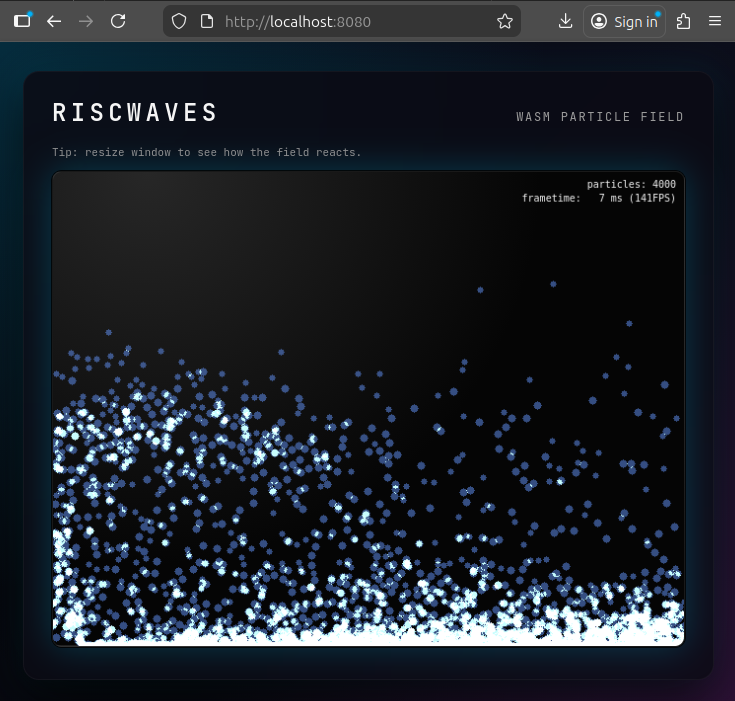

# riscwaves



A small WASM demo that visualizes particle waves driven by accelerometer-like input.

This README explains how to build the WebAssembly package and run the demo locally using Python's simple HTTP server.

**Build & Run (WASM)**

- **Install prerequisites**: ensure you have Rust toolchain, `wasm-pack`, and `python3` installed.

- **Build the WASM package** (from the repository root):

```bash
wasm-pack build --target web --out-dir www/pkg
```

- **Serve the `www/` directory** on your local network (allow other devices to connect):

```bash
# bind to all interfaces so other clients can access using http://<your-ip>:8080
python3 -m http.server 8080 --bind 0.0.0.0
```

- Open a browser to `http://localhost:8080` (or `http://<your-ip>:8080` from another device).

**Where to add custom logic**

- The WASM entry and particle demo live in `src/lib.rs`.
- Look for the functions marked with `=== CUSTOM ENTRY POINT ===` comments:
	- `initialize_custom_particles()` — called during startup to create particles.
	- `update_and_render_particles()` — called every frame; update particle physics and rendering here.

**Notes & tips**

- Use `hostname -I` to locate your machine IP for access from other devices on the same network.
- Re-run `wasm-pack build --target web --out-dir www/pkg` after changing Rust sources.
- For development iteration, you can keep the Python server running and refresh the browser after rebuilding.

### Notes

- 10000 particles, 7ms 
- 50000 particles, 27ms (16ms on iPad)
- 100000 particles, 45ms (25ms on iPad)

winit:
build profile: dev:
- 1000 particles, 13ms 80FPS
- 100000 particles, 4FPS
build profile release:
- 10000 particles, 7ms, 140FPS
- 50000 particles, 21ms, 47FPS
- 100000 particles, 45ms, 22FPS
with `RUSTFLAGS="-C target-feature=+simd128"` and release:
- 50000 particles, 21ms, 47FPS
added glam, with `RUSTFLAGS="-C target-feature=+simd128"` and release:
- 50000 particles, 21ms, 47FPS
replaced circle drawing with points:
- 50000 particles, 7ms, 140FPS
- 100000 particles, 7ms, 140FPS
addition of dilate across frame to enlarge pixels:
- 10000 particles, 7FPS